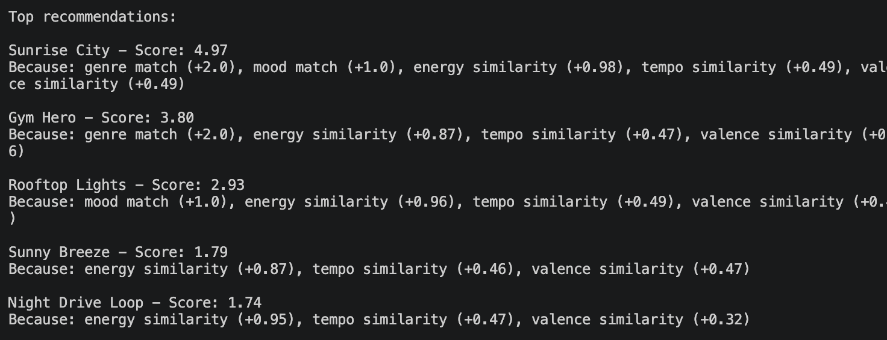
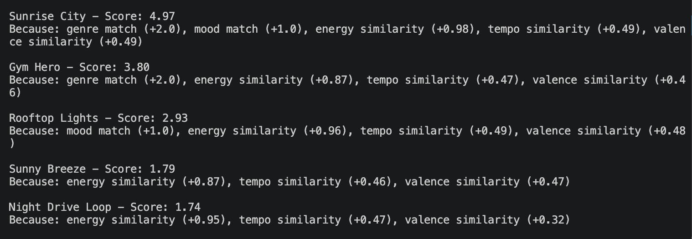
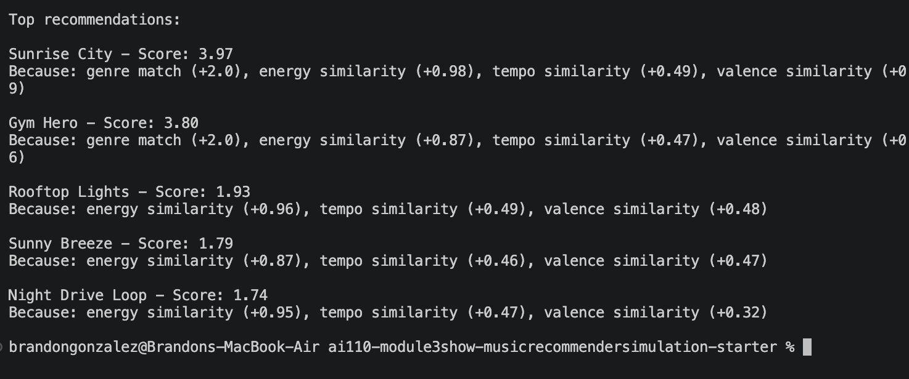

# Model Card: VibeFinder 1.0

## 1. Model Name

**VibeFinder 1.0** — Hybrid Music Recommender System

---

## 2. Intended Use

VibeFinder predicts which songs a user might enjoy by blending neural semantic similarity with rule-based feature matching. It surfaces a ranked top-K list from a small catalog based on a user's stated genre, mood, energy, tempo, valence, and acoustic preference. It is designed for classroom exploration of AI pipeline design — input validation, hybrid inference, and output guardrails. It is not intended for production music applications.

---

## 3. How the Model Works

VibeFinder uses a two-stage hybrid scorer:

**Stage 1 — Semantic similarity (60% weight):** Each song and the user query are converted to natural-language descriptions (e.g., *"A high-energy, fast-paced, emotionally positive pop song called 'Sunrise City'"*). These descriptions are encoded by `all-MiniLM-L6-v2`, a 22 MB sentence-transformer model, and cosine similarity is computed between the user vector and every song vector.

**Stage 2 — Rule-based scoring (40% weight):** Explicit features are scored directly: genre match earns +2.0 points, while energy, tempo, valence, and acousticness each contribute up to +1.0 using linear similarity functions. Raw rule scores are normalized to [0, 1] before blending.

**Final score:** `0.6 × semantic + 0.4 × rules`

Both input (Pydantic schema validation) and output (score clamping + explanation quality) are guarded before and after inference.

---

## 4. Data

The catalog contains 15 songs spanning 12 genres (pop, lofi, rock, jazz, R&B, indie pop, classical, hip-hop, metal, folk, electronic, synthwave). Each song includes: title, artist, genre, mood, energy (0–1), tempo (BPM), valence (0–1), danceability (0–1), and acousticness (0–1). No user listening history or lyrics data is included. The catalog is intentionally small and skews toward mainstream genres — classical, synthwave, and bossa nova have sparse representation.

---

## 5. Strengths

- Consistently surfaces genre-matching songs first for standard user profiles (HIGH_ENERGY_POP, CHILL_LOFI, DEEP_INTENSE_ROCK).
- The semantic layer correctly ranks "indie pop" near "pop" preferences without any explicit rule — something a pure rule-based system misses.
- Both guardrails reliably catch invalid inputs (out-of-range energy, negative tempo, empty strings) with field-level error messages before any inference runs.
- Explanations are interpretable: every recommendation shows its numeric semantic/rule breakdown and the specific rule signals that contributed.

---

## 6. Limitations and Bias

**Genre filter bubble:** Genre carries 2× the weight of every other feature in the rule layer. A great jazz track will rarely surface for a user requesting "lofi" even if energy, tempo, and valence are near-perfect matches.

**Mood is effectively dormant:** Removing mood from the rule scorer entirely did not change any song's ranking — only reduced raw scores uniformly. Genre and energy dominate so strongly that mood is redundant in the current weight configuration.

**Energy similarity is too forgiving:** Because `1 - abs(target - value)` is always positive, even a song with energy 0.1 gets a nonzero bonus for a user who wants energy 0.9. A threshold-based scorer would produce sharper separations between good and poor matches.

**Sparse niche-genre coverage:** A user requesting "synthwave" gets only one catalog match with no warning about thin coverage. The system does not surface catalog gaps to the user.

**Mainstream skew:** The dataset and weight configuration were implicitly designed around a "mainstream pop listener" mental model. Users with unconventional combinations (high acoustic + high energy, sad mood + high valence) receive less accurate recommendations because the catalog and scoring assumptions do not account for those profiles.

---

## 7. Evaluation

Three primary user profiles were tested: HIGH_ENERGY_POP (pop, happy, energy 0.9, tempo 130, valence 0.9, no acoustic), CHILL_LOFI (lofi, chill, energy 0.3, tempo 80, valence 0.6, acoustic), and DEEP_INTENSE_ROCK (rock, intense, energy 0.95, tempo 150, valence 0.3, no acoustic). Rankings were checked for intuitive correctness — whether the top songs matched the stated preferences across genre, energy, and tempo.

A feature-removal experiment was run by disabling mood scoring and re-running all profiles. The result: no song changed rank, confirming that mood contributes nothing beyond a uniform score reduction.

Edge-case profiles were also tested: conflicting energy/mood pairs, extreme values (energy 1.0, tempo 200), all-zero values, and invalid inputs (negative energy, empty strings). The input guard caught all invalid cases. Conflicting valid profiles (e.g., high acoustic + high energy) were accepted by the guard but produced intuition-misaligned recommendations.

The two pytest unit tests verified ranking direction and explanation non-triviality, but they could not have detected the mood-redundancy issue — that required empirical profiling.

---

## 8. Project Screenshots

**Phase 3 — Rule-based scoring baseline**

**Phase 4 — Hybrid scoring with guardrails**

**Feature-removal experiment — mood scoring disabled**

---

## 9. Future Work

- Replace linear energy/tempo similarity with threshold-based scoring to sharpen separations between good and poor matches.
- Add diversity-aware re-ranking (e.g., Maximum Marginal Relevance) to reduce the genre filter bubble.
- Surface catalog coverage warnings when a user's requested genre has fewer than three matches.
- Give mood a fixed minimum weight floor so it cannot be drowned out by genre and energy.
- Expand the catalog and balance genre representation to reduce mainstream skew.
- Learn the 60/40 semantic/rule split from user feedback rather than fixing it statically.

---

## 10. Personal Reflection

Building VibeFinder forced me to confront a core tension in recommendation systems: interpretability vs. flexibility. Rule-based systems are transparent — you can read the weights and know exactly why a song ranked first — but they are brittle, unable to understand that "indie pop" is close to "pop" or that "serene" and "calm" are near-synonyms. Neural systems handle those fuzzy relationships naturally but operate as black boxes. The hybrid approach here is a first-principles attempt to get the best of both.

The bigger lesson was about bias. I expected the system to produce sensible results across diverse user profiles, and it mostly did — until I tested profiles with unusual combinations like high acoustic preference + high energy, or sad mood + high valence. Those edge cases exposed that the system was built implicitly around a "mainstream pop listener" mental model. The genre double-weight, the linear similarity functions, and the 15-song catalog all skew toward that center. Real recommenders face this at scale: the data and the weights encode whose tastes were considered "normal" when the system was designed. Human judgment is still essential for catching those assumptions — the model has no way to notice them itself.

The most surprising testing finding: both unit tests pass, yet they were useless for catching the system's biggest behavioral flaw. Mood having zero effect on rankings only appeared through the feature-removal experiment — manually commenting out a feature and re-running all profiles. This taught me that code correctness and behavioral correctness are measured differently, and for a recommender system, empirical profiling reveals far more than assertion-based unit tests.

---

## 11. What This Project Says About Me as an AI Engineer

This project reflects several things about how I approach AI engineering:

**I prioritize understanding over black-box output.** Rather than accepting the recommender's results at face value, I ran controlled experiments (feature removal, edge-case profiles) to understand *why* the system behaved the way it did. That instinct — to interrogate the model rather than trust it — is what surfaced the mood-redundancy flaw and the genre filter bubble.

**I think about the full pipeline, not just the model.** VibeFinder was designed with guardrails on both ends: input validation before inference and output correction after. This two-gate pattern reflects a production-minded approach — the model is just one component in a system that needs to be safe and reliable at every boundary.

**I question AI suggestions, including my own tools.** When Claude proposed embedding raw numeric vectors into a sentence-transformer, I pushed back because I understood why that would fail. Using AI as a coding partner effectively requires knowing enough to identify when its suggestions are wrong — blind acceptance would have shipped a subtly broken embedder.

**I document what didn't work, not just what did.** The limitations section of this card is longer than the strengths section. That is intentional. Knowing where a system fails and why is more valuable for future development than a polished list of successes. An AI engineer who only reports wins is an AI engineer who will repeat the same mistakes.

**I am early in my AI engineering journey, and that is visible in this project.** The 15-song catalog, the static weight configuration, and the linear similarity functions are the choices of someone learning the fundamentals, not deploying at scale. But the instinct to build guardrails, run ablation experiments, and document bias is the foundation that production AI engineering is built on. This project is where that foundation started.
